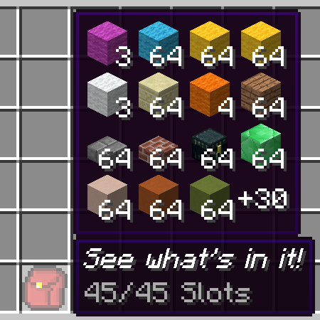
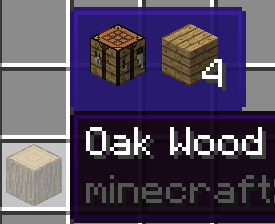

# BackpackDisplay

Adds a tooltip to show what's in your backpack, shulker box or other container item.  
Configurable of how to get contents for the container item.  
The mod has out-of-the-box support for vanilla shulker boxes, storage drawers drawers, and forestry backpacks. You can add support to more items by writing custom rules in the mod's config.  

Configurable options(See the mod's config): 
- The items that the mod's tooltip should be shown for  
- Position and color of the tooltip  
- Optional hold or release a keybind to show the tooltip  

## Downloads
[CurseForge](https://www.curseforge.com/minecraft/mc-mods/backpack-display) [Modrinth](https://modrinth.com/mod/backpack-display)  

## Config Format
`displayRules` is the main config of the mod. It lets you to add new container  items to display the backpack tooltip, with the following format:  
Format: `<modID>:<itemID>[:meta]#<rule type>#<rule definition>`  

meta is a comma-separated list for meta-values to match.  
For example,`1,2,5-8` allows tooltip to show on the item with metadata 1,2,5,6,7,8.  
When meta is absent, tooltip to show on the item ignoring meta.  

Rule definition is according to the rule type selected.  

### Paths
Path is commonly used in the rules, and have a format like `path.to.the.item`.  
For example, in this NBT structure: 
```
{"list":[{"key1":"value"},{"key2":"item"}]}
```
The path `list.1.key2` will get the tag "item" from it.

### List rule
Rule type: `list`  

In this rule, items are all under a ListTag or a CompoundTag.  

Rule definition:`path.to.the.list[;path.to.the.itemstack[;path.to.the.counts]]`  
The last 2 paths is relative to the tag item in the list. 
If the counts is absent, the count in the itemstack is used instead.

Example: Show contents when hovering a purple shulker box  
```
minecraft:purple_shulker_box#list#BlockEntityTag.Items
```

Example 2: Show contents in an AE2 storage cell  
```
appliedenergistics2:storage_cell_64k#list#;;Cnt
```

### Single rule
Rule type: `single`  

In this rule, an item is under a fixed path, with an optional external count value.  

Rule definition:`path.to.the.itemstack[;path.to.the.counts[;calculations for the counts]]`  
If the counts is absent, the count in the itemstack is used instead.  

Example: Show content for every basic drawers in storage drawers mod
```
storagedrawers:basicdrawers:0#single#BlockEntityTag.Drawers.0.Item;BlockEntityTag.Drawers.0.Count
storagedrawers:basicdrawers:1,3#single#BlockEntityTag.Drawers.0.Item;BlockEntityTag.Drawers.0.Count
storagedrawers:basicdrawers:1,3#single#BlockEntityTag.Drawers.1.Item;BlockEntityTag.Drawers.1.Count
storagedrawers:basicdrawers:2,4#single#BlockEntityTag.Drawers.0.Item;BlockEntityTag.Drawers.0.Count
storagedrawers:basicdrawers:2,4#single#BlockEntityTag.Drawers.1.Item;BlockEntityTag.Drawers.1.Count
storagedrawers:basicdrawers:2,4#single#BlockEntityTag.Drawers.2.Item;BlockEntityTag.Drawers.2.Count
storagedrawers:basicdrawers:2,4#single#BlockEntityTag.Drawers.3.Item;BlockEntityTag.Drawers.3.Count
```

This rule supports further calculation to get the real item count if it's not in the tag directly but can be calculated from the values in the tag.  
Calculations are a string starting with a operator in `+-*/^%` and followed by a path. The order of calculation is like that on a basic calculator that cannot input expressions.  
All calculations is done in integer.

Example: Show content for compact drawers in storage drawers mod  
```
storagedrawers:compdrawers#single#BlockEntityTag.Drawers.Items.0.Item;BlockEntityTag.Drawers.Count;/BlockEntityTag.Drawers.Items.0.Conv
storagedrawers:compdrawers#single#BlockEntityTag.Drawers.Items.1.Item;BlockEntityTag.Drawers.Count;/BlockEntityTag.Drawers.Items.1.Conv
storagedrawers:compdrawers#single#BlockEntityTag.Drawers.Items.2.Item;BlockEntityTag.Drawers.Count;/BlockEntityTag.Drawers.Items.2.Conv
```

### Crafttweaker Support
Starting from v1.3, crafttweaker is supported to add custom functions to get what items to display.  
It's suggested to only write entries in a script with `#sideonly client` Preprocessor. Otherwise it will cause errors on dedicated server, because this mod is client only.  

```
import mods.backpackdisplay.BackpackDisplay;
// IIngredient to match items to add the tooltip, function to return an array of items from a given itemstack
BackpackDisplay.addBackDisplay( IIngredient, (IItemStack) -> IItemStack[] );
```
Example: show a crafting table and the crafting result for every wood log in `<ore:logWood>`
```
#sideonly client
import mods.backpackdisplay.BackpackDisplay;
import crafttweaker.item.IItemStack;
BackpackDisplay.addBackDisplay(<ore:logWood>,function(item){
    var items = [<minecraft:crafting_table>,recipes.craft([[item]])] as IItemStack[];
    return items;
});
```
  

With both crafttweaker rules and normal rules present on an item, items from crafttweaker support will appear before items from normal rules.  

## Fluid support
### Simple Fluid containers
Same as Items, but with only the item ID and metadata.  
Fluid is get from forge. No customization needed or supported.  
Example: (water bucket shows water in it)  
```
minecraft:water_bucket
```
### Crafttweaker
Same as Items, except the class is `mods.backpackdisplay.BackpackDisplayFluid` and the output is `IFluidStack[]`  
Example: (ice block shows 1000mB water in it)  
```
#sideonly client
import mods.backpackdisplay.BackpackDisplayFluid;
import crafttweaker.fluid.IFluidStack;
BackpackDisplayFluid.addBackDisplay(<minecraft:ice>,function(item){
    var fluids = [<liquid:water>*1000] as IFluidStack[];
    return fluids;
});
```

## Plugin support  
Starting from v1.5.0, plugins are supported. One can add more sections to this mod's tooltip, extending its function.  
Implement [IDisplaySection](src/main/java/io/bluebeaker/backpackdisplay/api/IDisplaySection.java) to make your display section.  
Then register it by calling [Secions.addSection](src/main/java/io/bluebeaker/backpackdisplay/api/Sections.java) in FMLInitializationEvent.  